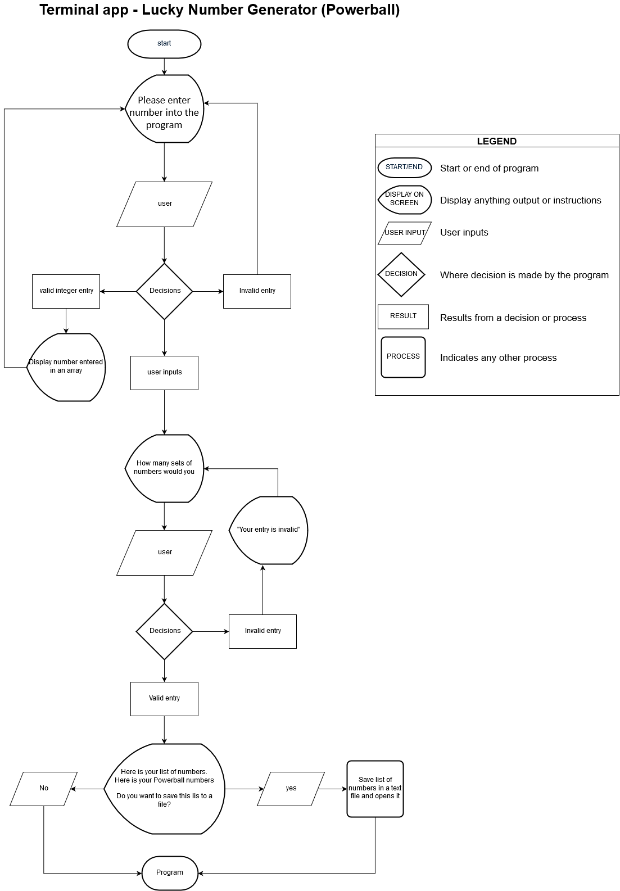
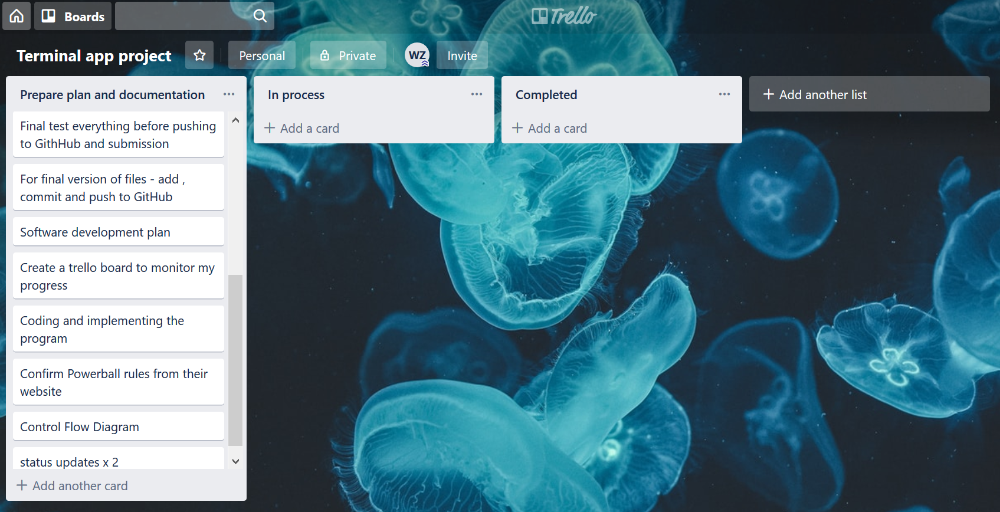
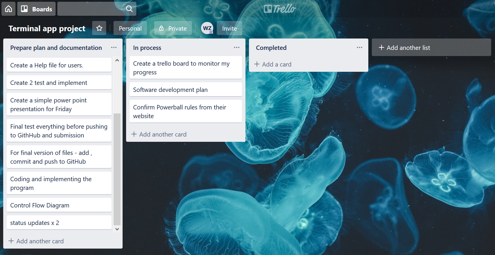
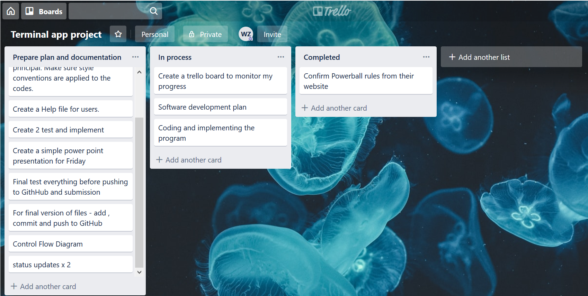
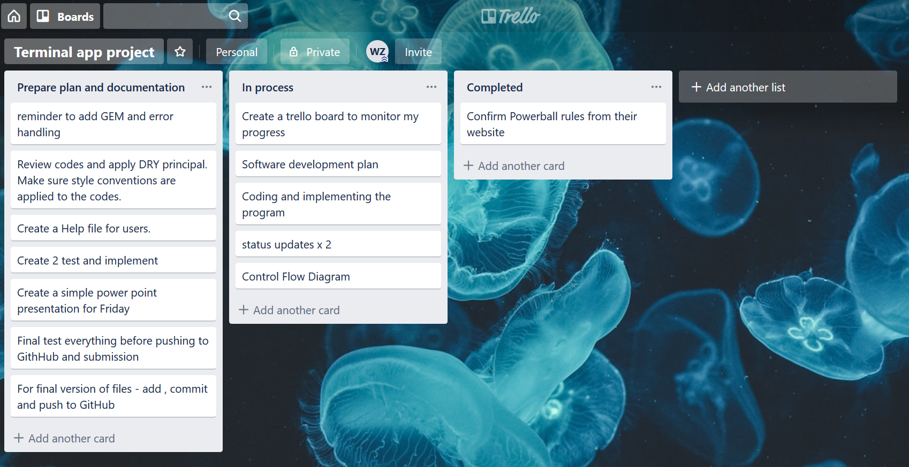
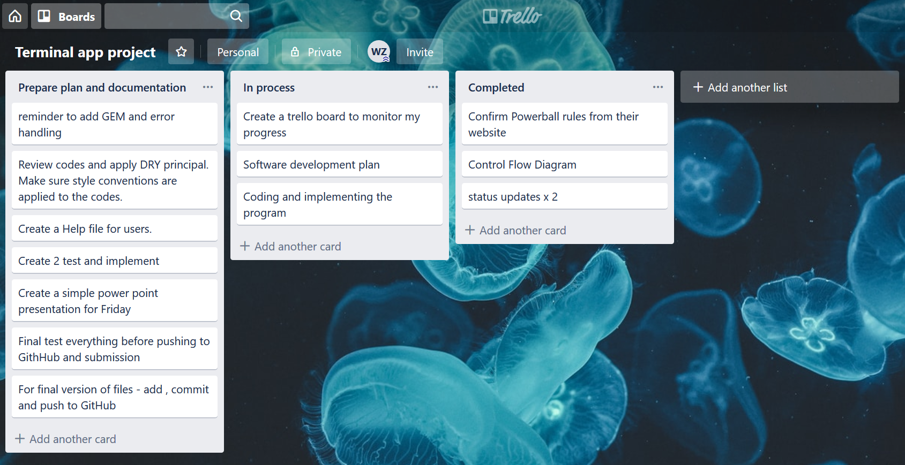
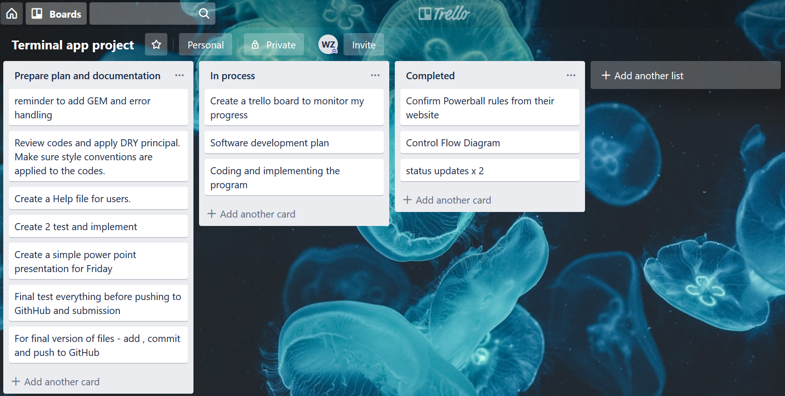
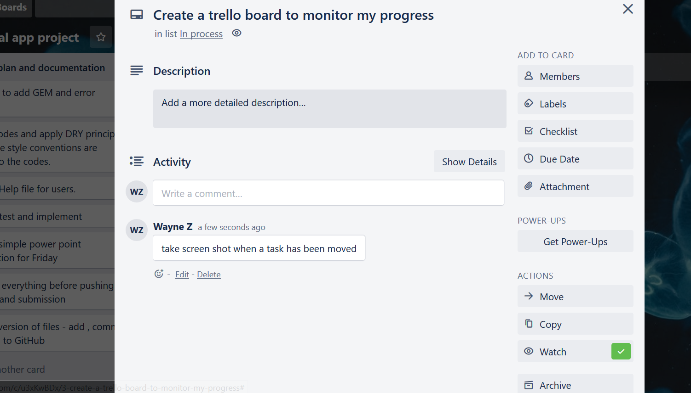
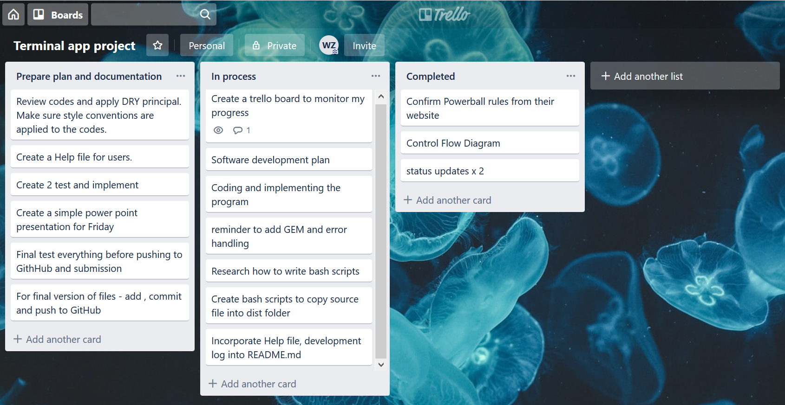

# *Terminal app - Lucky Number Generator(Powerball) Ver 3.0**

The GitHub repository can be seen in this location

https://github.com/waynezdev/terminal_app_project

## **Statement of Purpose and Scope**

*- **identify** the problem it will solve and **explain** why you are developing it - **identify** the target audience  - **explain** how a member of the target audience will use it*

Problem

This application is aim to provide lottery syndicate groups a more efficient way to choose large set of numbers 

Lottery syndicate groups usually consist of between 5 to 10 people. They can be made up of friends or colleagues. The way they choose their numbers for each entry is usually by using auto picks at the time of purchasing a ticket. They have no control of the numbers they would like to choose. For groups that choose their numbers it can be hard to coordinate everyone’s numbers and it is time consuming. 

This application will provide some assistance in giving them some control over which numbers they would like to be included in their entry tickets. It can accommodate everyone's favourite numbers so everyone will have a chance to have their number in the tickets. It will help them generate  large sets of numbers based on their choice of numbers for each entry

 

 

## **Features**

The following list highlights the important features in the **Lucky Number Generator (Powerball)**. These features important because together they increase the efficiency in choosing large set of numbers, saving user time and headache.

1. Quick pick Lucky Numbers – the program will let user input multiple Lucky Numbers and it will choose up to 7 random numbers, 1 Powerball number and display them. Each user input will be stored in an array. A method will be used to pick 7 unique numbers from that array and 1 number from the same array. This is to simulate the division 1 winning numbers. In Powerball there are two barrels of numbers. The first barrel has numbers from 1 to 35 inclusive. The has numbers from 1 to 20 inclusive. From the first barrel 7 main numbers are drawn. From the second barrel Powerball number is drawn. To win Division 1 you must match all 7 winning numbers plus the Powerball in a single game.

 

2. Create sets of numbers – the user may specify how many sets of the random pick from feature 1 and display all the sets. This feature is to save users from typing in numbers in the array every time they want to generate a set of numbers. Instead the program will generate the number of sets they want. The output will clearly display which is the 7 main number sets and which is the Powerball number set.

 

3. Save your numbers - The user can choose to save the outputs in a text file and share it with other people. This will give the user some convenience if they are not the person purchasing the tickets or they want others to see the final list of numbers.

 

## **User Interaction and Experience**

 

This program is mainly based on instructions/questions and user input. The main goal is to generate a list of lotto numbers for the user.

\1.       Entering favourite numbers

The first thing the program ask the user is to enter in their favourite numbers. Many users have numbers which they believe to be lucky or helps them increase their chances in winning the jackpot. The user will enter each number into the program and each number will be stored in an array. Once they have entered all their numbers they can input “done” to let the program know they have finish the input.

\2.       Generating multiple sets of Powerball entry numbers

 

After entering all the numbers the program will display their list of favourite numbers in an array.

puts "Here is your final list of number(s) 

 

Then the program will also ask the user how many sets of entry numbers they would like to generate. Once the user enter a number the program will output different list of entry numbers and Powerball numbers in arrays.

\3.       Save the numbers 

The users will be given an option to save the entry numbers into a text file. They will be given the option to choose save or exit without saving. If they choose to save the numbers the actual file will open up with their number in it for their viewing.

\4.       Exiting 

The program will automatically close after the number sets have been displayed and saved. 

 

 

 

## **Control Flow Diagram**




## **Implementation Plan**


| Features                                  | Task                                                         | Priority  | Due date |
| :---------------------------------------- | :----------------------------------------------------------- | :-------- | :------- |
| Welcoming message                         | Create name for program                                      | normal    | 6/9/19   |
|                                           | Implement into source code                                   | normal    | 6/9/19   |
|                                           | Incorporate font styling GEM to differentiate welcoming message from other text | normal    | 5/9/19   |
| Quick pick numbers                        | Create instruction to ask users for number input             | high      | 4/9/19   |
|                                           | Create loop to receive user input and option to instruct the program that input is complete | high      | 4/9/19   |
|                                           | Set number range (1 to 35 inclusive) to prevent user inputting invalid numbers | high      | 4/9/19   |
|                                           | Set keyword "done" to indicate completion of user input      | high      | 4/9/10   |
|                                           | Write code to output 7 main entry numbers and 1 powerball number | high      | 4/9/19   |
|                                           | Create an array of numbers from user inputs                  | high      | 4/9/19   |
| Generating multiple sets of entry numbers | Create methods in source code to generate 7 main entry numbers from the array | high      | 4/9/19   |
|                                           | Create methods in source code to generate 1 powerball numbers from the same array | high      | 4/9/19   |
|                                           | Create a question to ask for quantity of number sets the user would like to generate | high      | 4/9/19   |
|                                           | Prevent user requesting large quantity of number sets by add code to limit the quantity to 50 sets | very high | 4/9/19   |
|                                           | Print number sets on screen for viewing                      | normal    | 5/9/19   |
|                                           | Test number sets are generated properly and each array is unique | normal    | 5/9/19   |
| Save your numbers                         | Research how to write to a file                              | very high | 4/9/19   |
|                                           | Update source code to save number set outputs into a text file | high      | 5/9/19   |
|                                           | Prints "good luck!" on screen and ends the program           | normal    | 5/9/19   |
|                                           | Test saving output into the right file and format            | high      | 5/9/19   |


## Status Updates

##### Status update 3/9/2019 - large number sets request

Initial testing of following features shows everything is working
-Generating an array of numbers from user inputs is working fine.
-Randomly output lotto numbers and powerball number is working fine
-Allowing the user to specify number of sets of outputs is also working.

However, testing by other devs in the group shows one major issue

If user specify a large quantity of sets it slowed down the computer and it might have crashed the computer. The program needs to be aborted by ^C command.

To prevent user accidently request a large quantity of number sets. I have update the code with an "if statement" to stop the process of producing the final output.

valid_set = true

while valid_set == true

```
p "How many sets of numbers would you like?"
set_number = gets.chomp.to_i

if set_number > 50 or set_number <= 0
p "too many sets or invalid"
```

   


```
else 
p "your lucky number list is"
p set_number.times.map{random_pick(user_input_list)}
p "your powerball is"
p set_number.times.map{powerball_pick(user_input_list)}
valid_set = false #or break
end
```

end

This "if statement" warns the user that their request is too large or below zero. Then it will keep asking for the number of sets they need until it is within range and produce the lotto numbers.


##### Status update 5/9/2019 - saving output to text file

The last feature I built was for the program to save the outputs into a text file. The feature is working fine but if there was a lot of arrays the they would all be printed in one line. This is not a user friendly way to display the results. 

The way to over come this problem was to use the block method and print out each array in a new line.

The following code will print the main entry number sets in separate lines

```
text_file = File.open "save_your_lotto_number.txt", "a"


text_file.puts "your lucky number list is"

lucky_num.each do |lotto_num|

​    

​    text_file.puts lotto_num.to_s

end
```


The following code will print the powerballs in separate lines

```
text_file = File.open "save_your_lotto_number.txt", "a"


text_file.puts "your powerballs are"

powerball.each do |pball|

​    

​    text_file.puts pball.to_s


end

text_file.close
```

The update codes worked as expected and gives an easy to read format of the outputs.


## **Help file** 

*accurately* describe: steps to install the application; dependencies 
required by the application; system/hardware requirements; features of 
the application

You can find all relevant files in my GitHub repository 

https://github.com/waynezdev/terminal_app_project

##### Dependencies

ruby gem - colorize

ruby gem - artii

##### Installation

To run the program, find the lucky_number.rb file on GitHub and save it in a folder and double click. This will open and run the program with all dependencies installed.

##### how to use the features in Lucky Number Generator(Powerball)

1. Starting the program users will give ask to enter their favourite numbers. There are no limit to how many numbers you can enter. Once all the numbers are entered, user will need to input "done" to move on to the next process
2. The next process will be asking the user how many sets of lotto numbers and powerball number they would like to generate. Then sets of 7 lotto numbers and 1 powerball numbers will be generated form the list of favourite numbers.
3. The number sets will be displayed on screen and also saved to a text file (save_your_lotto_number.txt) for easy access.

##### System requirements

Operating System - Windows 95 or later, Mac OS X 10 or later
Processor Speed - Pentium 4, 3.2 GHz or Power PC G5, 2.0 GHz
Memory - At least 512Mb
Graphics Card - ATI Radeon 9800 w/ 256 MB video memory
Hard Disk Space -  1GB
Internet connection

## **Testing**

##### Test 1

Input numbers larger than 35 or letters when asked to input favourite numbers. This should return a message on the screen saying "your number is invalid". This test is to simulate the 35 numbers in the Powerball lotto. 

##### Test 2

Test number set generation - input a large number (more than 50) or letters when asked how many sets of number sets you would like to generate. This should return a message on the screen saying "too many sets or invalid". This test is to make sure the program does not run too many times and crash the computer.


## **Project management**

The following screenshots shows certain time during the development of my program


















